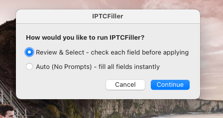
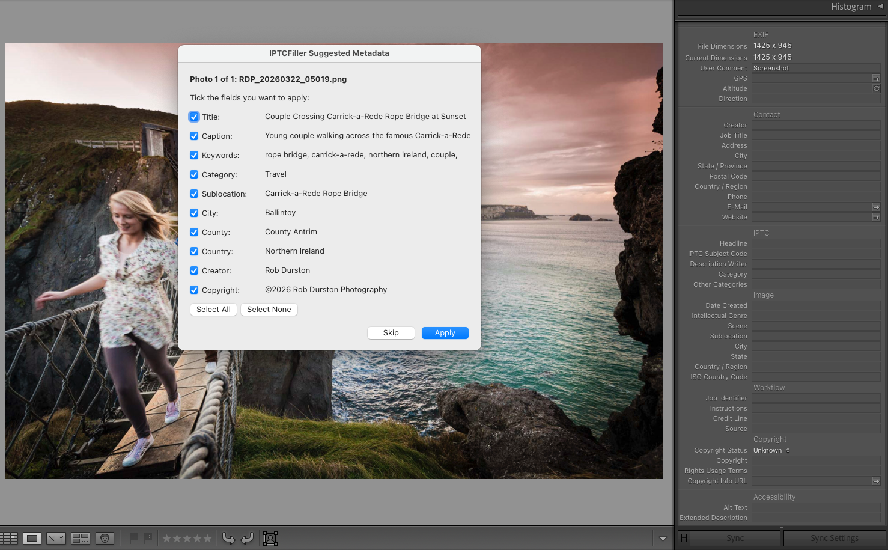
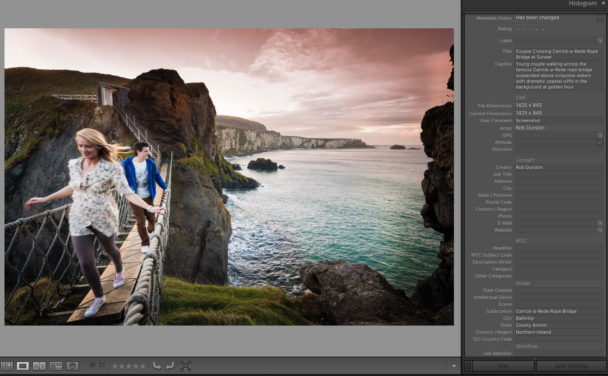
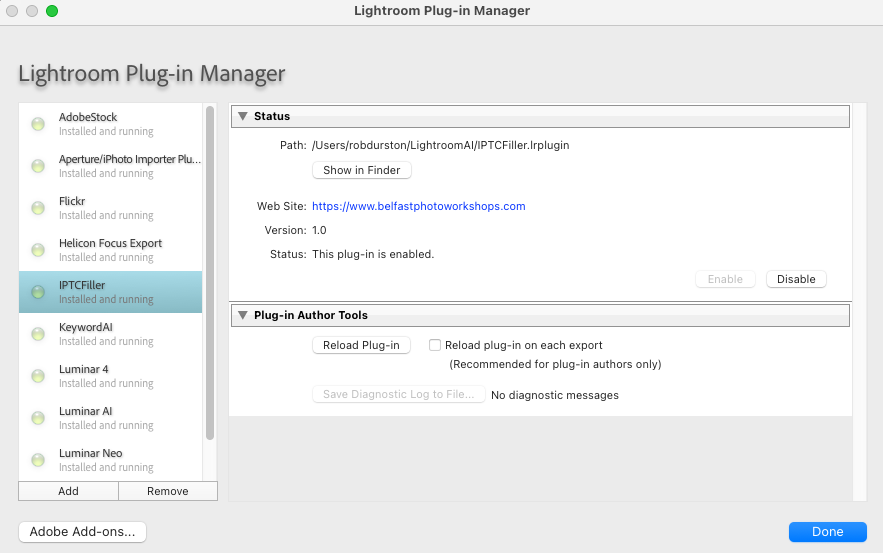

# IPTCFiller — AI-Powered IPTC Metadata for Adobe Lightroom Classic

**IPTCFiller** is a free, open-source Adobe Lightroom Classic plugin that uses Claude AI and GPS data to automatically fill in your photo's IPTC metadata — saving you hours of manual data entry.

Built by **[Rob Durston](https://www.belfastphotoworkshops.com)** & Claude (Anthropic) — [Belfast Photo Workshops](https://www.belfastphotoworkshops.com)

---

## Screenshots


*Choose between Review & Select or fully automatic mode*


*Review & Select mode — tick the fields you want to apply before committing*


*All IPTC fields filled in automatically including location from GPS*


*Accessible from Library → Plug-in Extras → Fill IPTC Metadata with AI*


*IPTCFiller installed and running in the Lightroom Plug-in Manager*

---

## What It Does

Select one or more photos in Lightroom, run the plugin, and within seconds Claude AI will analyse each image and fill in:

- 📝 **Title** — A short professional title (max 70 characters)
- 📄 **Caption** — A descriptive stock photography caption (max 200 characters)
- 🏷️ **Keywords** — 15–30 relevant keywords in lowercase
- 📂 **Category** — Nature, People, Architecture, Travel, Sport, Food or Business
- 📍 **Sublocation** — Specific place name (e.g. Carrick-a-Rede Rope Bridge)
- 🏘️ **City** — City or town name
- 🗺️ **County** — County name (essential for UK and Irish stock photography)
- 🌍 **Country** — Country name
- 👤 **Creator** — Your name (pre-filled automatically)
- © **Copyright** — Your copyright notice (pre-filled automatically)
- ✅ **Copyright Status** — Set to Copyrighted automatically

### Location from GPS
If your photo has GPS data, IPTCFiller automatically reverse geocodes the coordinates to fill in Sublocation, City, County and Country. No manual typing required.

**Special Northern Ireland handling** — IPTCFiller correctly identifies photos taken in Northern Ireland (County Antrim, County Down, County Armagh, County Tyrone, County Fermanagh, County Londonderry) and sets the country to Northern Ireland rather than the generic United Kingdom that some geocoding services return.

### Two Modes

**Review & Select** — Shows you all suggested fields with checkboxes. Tick the ones you want, untick the ones you don't, then click Apply. Includes Select All and Select None buttons.

**Auto (No Prompts)** — Automatically analyses all selected photos and writes all metadata directly with no interruptions. Shows a progress bar and a summary when done. Perfect for batch processing.

---

## Screenshots

---

## Requirements

Before installing the plugin you will need the following:

- **Adobe Lightroom Classic** (version 5 or later)
- **Python 3** — Download free from [python.org](https://python.org)
- **An Anthropic API key** — Sign up at [console.anthropic.com](https://console.anthropic.com)
- **Anthropic API credits** — Add a minimum of $5 at [console.anthropic.com](https://console.anthropic.com). Each photo analysis costs a fraction of a penny so $5 will last a very long time.

### Supported Image Formats
- JPEG (.jpg, .jpeg)
- PNG (.png)
- HEIC (.heic) — iPhone photos
- WebP (.webp)
- RAW files are supported as long as Lightroom has generated a preview

---

## Installation

### Step 1 — Install Python 3
Download and install Python 3 from [python.org/downloads](https://python.org/downloads).

**Mac users:** Just click Install — Python is added to your path automatically.

**Windows users:** On the first screen of the installer, make sure to tick **"Add Python to PATH"** before clicking Install.

To verify Python installed correctly, open Terminal (Mac) or Command Prompt (Windows) and type:
```
python3 --version
```
You should see a version number like `Python 3.13.x`.

### Step 2 — Install Required Python Libraries
In Terminal or Command Prompt, run:
```
pip3 install anthropic Pillow pillow-heif geopy
```

### Step 3 — Fix SSL Certificates (Mac only)
Run this once to fix SSL certificate issues with the GPS geocoding service:
```
/Applications/Python\ 3.13/Install\ Certificates.command
```

### Step 4 — Get an Anthropic API Key
1. Go to [console.anthropic.com](https://console.anthropic.com) and create a free account
2. Click **API Keys** in the left sidebar
3. Click **Create Key**, give it a name like "Lightroom Plugin"
4. Copy the key — it starts with `sk-ant-...`
5. **Important:** Save it somewhere safe. You won't be able to see it again after closing the page.
6. Go to **Plans & Billing** and add at least $5 in credits

### Step 5 — Download the Plugin
Click the green **Code** button at the top of this page and choose **Download ZIP**. Unzip the file and you will find:
- `IPTCFiller.lrplugin` — the Lightroom plugin folder
- `iptc_filler.py` — the Python helper script

### Step 6 — Set Up the Files
Create a folder called `LightroomAI` in your home folder:

**Mac:**
```
mkdir ~/LightroomAI
```
**Windows:**
```
mkdir %USERPROFILE%\LightroomAI
```

Copy both `IPTCFiller.lrplugin` and `iptc_filler.py` into that `LightroomAI` folder.

### Step 7 — Add Your API Key
Open `iptc_filler.py` in a text editor and find this line near the top:
```
API_KEY = "YOUR-API-KEY-HERE"
```
Replace `YOUR-API-KEY-HERE` with your actual Anthropic API key. Save the file.

### Step 8 — Install the Plugin in Lightroom
1. Open **Lightroom Classic**
2. Go to **File → Plug-in Manager**
3. Click **Add**
4. Navigate to your `LightroomAI` folder and select `IPTCFiller.lrplugin`
5. Click **Add Plug-in**
6. The plugin should appear in the list with a green dot and say "Installed and running"
7. Click **Done**

---

## Usage

1. Select one or more photos in Lightroom's Library module
2. Go to **Library → Plug-in Extras → Fill IPTC Metadata with AI**
3. Choose your mode:
   - **Review & Select** — review and tick fields before applying
   - **Auto (No Prompts)** — fill all fields automatically

---

## How Much Does It Cost To Run?

The plugin uses the Anthropic Claude API which charges per use. As a rough guide:
- Analysing a single photo costs approximately **$0.01 or less**
- $5 of credits will comfortably cover **hundreds of photos**
- You only pay for what you use — there is no subscription

---

## Troubleshooting

**"No data returned"**
- Check your API key is correctly pasted into `iptc_filler.py`
- Make sure you have credits in your Anthropic account at [console.anthropic.com](https://console.anthropic.com)
- Test the Python script directly in Terminal: `python3 ~/LightroomAI/iptc_filler.py /path/to/photo.jpg`

**Location fields are empty**
- Make sure you ran the SSL certificate fix (Step 3 above)
- Check your photo has GPS data in Lightroom's metadata panel
- The geocoding service requires an internet connection

**Country shows United Kingdom instead of Northern Ireland**
- Make sure you are using the latest version of `iptc_filler.py` which includes the Northern Ireland fix

**Plugin not appearing in Library menu**
- Make sure you are in the **Library** module in Lightroom (not Develop)
- Check the plugin shows a green dot in Plug-in Manager

---

## Privacy

Your photos are sent to Anthropic's Claude API for analysis. GPS coordinates are sent to OpenStreetMap's Nominatim geocoding service to resolve location names. No photos or metadata are stored or shared beyond what is required to call these APIs. We recommend reviewing [Anthropic's privacy policy](https://www.anthropic.com/privacy) before use.

---

## Also Available

**[KeywordAI](https://github.com/BPW-Photo/KeywordAI-Lightroom-Plugin)** — Our companion plugin for AI-powered keyword suggestions in Lightroom Classic.

---

## Contributing

Contributions are welcome! If you have ideas for improvements, find a bug, or want to add a feature, please open an issue or submit a pull request.

Some ideas for future development:
- Windows installer / setup wizard
- Customisable photographer name and copyright template
- Support for additional geocoding services
- Batch processing with rate limiting
- XMP sidecar file support

---

## Licence

This project is released under the **MIT Licence** — free to use, modify, and distribute.

---

## Acknowledgements

- Built with the [Anthropic Claude API](https://www.anthropic.com)
- Location data from [OpenStreetMap](https://www.openstreetmap.org) via [Geopy](https://github.com/geopy/geopy)
- Uses the [Adobe Lightroom Classic SDK](https://developer.adobe.com/lightroom/)
- Image processing via [Pillow](https://python-pillow.org) and [pillow-heif](https://github.com/bigcat88/pillow_heif)

---

*Made with ☕ and AI by [Rob Durston](https://www.belfastphotoworkshops.com) & Claude — [Belfast Photo Workshops](https://www.belfastphotoworkshops.com)*
